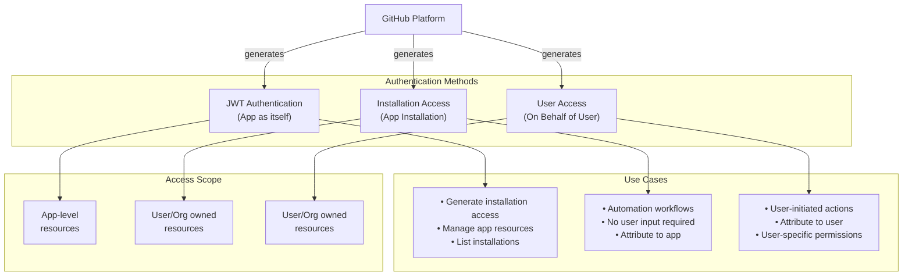
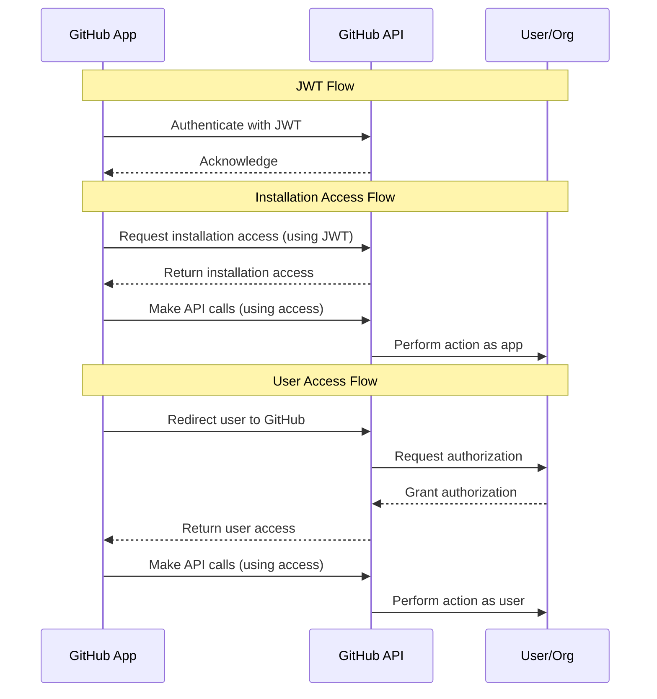

# GitHub App Authentication Architecture

This document outlines the different authentication methods available for GitHub Apps.

## Authentication Overview

GitHub Apps support three primary authentication methods:

1. **App Authentication** - Authenticate as the GitHub App itself using JWT
2. **Installation Authentication** - Authenticate as an app installation using installation access
3. **User Authentication** - Authenticate on behalf of a user using user access

## Architecture Diagram

## Authentication Methods Details

### 1. App Authentication (JWT)

**Use this when:**
- Your app needs to generate installation access
- Your app needs to manage its own resources
- Your app needs to list accounts where it is installed

**Authentication Type:** JSON Web (JWT)

**Key Features:**
- Authenticates the app itself
- Used to generate other access types
- App-level scope

### 2. Installation Authentication

**Use this when:**
- You want to perform automation workflows
- User input is not required
- You want to attribute actions to the app

**Authentication Type:** Installation Access

**Key Features:**
- Authenticates as an app installation
- Access to user/organization owned resources
- Ideal for automated workflows

### 3. User Authentication

**Use this when:**
- You want to attribute actions to a specific user
- You want to ensure only user-authorized actions are performed
- You need user-specific permissions

**Authentication Type:** User Access

**Key Features:**
- Authenticates on behalf of a user
- Access to user/organization owned resources
- User-level accountability

## Flow Diagram

## References

- [Authenticating as a GitHub App](https://docs.github.com/en/apps/creating-github-apps/authenticating-with-a-github-app/authenticating-as-a-github-app)
- [Authenticating as a GitHub App Installation](https://docs.github.com/en/apps/creating-github-apps/authenticating-with-a-github-app/authenticating-as-a-github-app-installation)
- [Authenticating with a GitHub App on behalf of a user](https://docs.github.com/en/apps/creating-github-apps/authenticating-with-a-github-app/authenticating-with-a-github-app-on-behalf-of-a-user)
